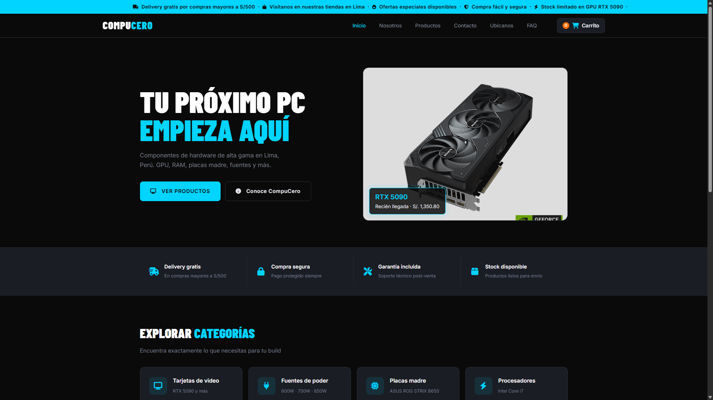
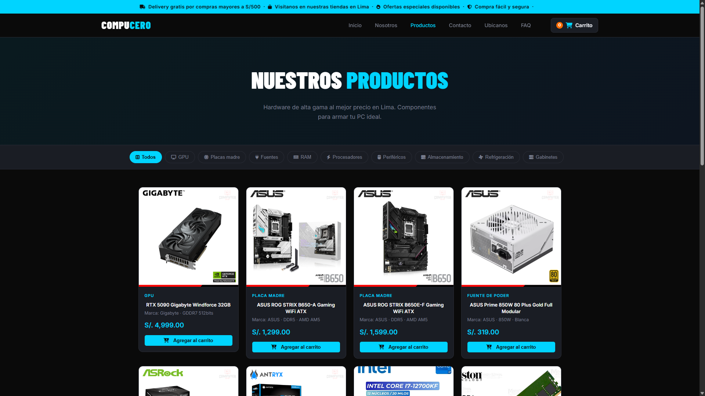
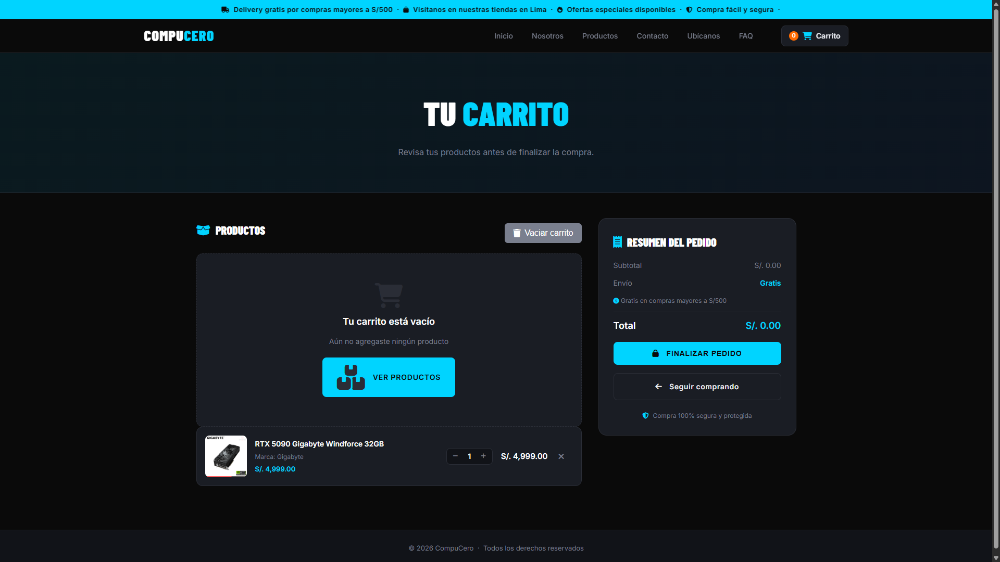

# 🖥️ CompuCero | E-Commerce de Hardware & Componentes


<p align="center">
  
</p>

Plataforma web de comercio electrónico enfocada en la venta de hardware de alta gama y componentes de PC. Desarrollada con tecnologías nativas (Vanilla) como proyecto académico en la **UTP Lima**, simulando un entorno de negocio real con UX fluida y diseño visual dark/gamer.

---

## 🖼️ Vista previa

### 🏠 Hero — Landing Page


### 🛍️ Catálogo de Productos


### 🛒 Carrito de Compras


---

## ✨ Características implementadas

- 🏠 **Landing Page** — Hero con producto destacado, CTAs y banner de promociones
- 🛍️ **Catálogo de productos** — Filtros por categoría (GPU, RAM, Placas madre, Fuentes, Procesadores, etc.)
- 🛒 **Carrito de compras** — Agregar/quitar productos, resumen del pedido y cálculo de envío
- 📱 **Diseño responsive** — Adaptado para móvil, tablet y escritorio
- 🏢 **Sección Nosotros** — Narrativa de marca, misión y visión
- ❓ **FAQ** — Preguntas frecuentes
- 📍 **Ubícanos** — Información de tiendas en Lima

---

## 🛠️ Stack tecnológico

| Tecnología | Uso |
|---|---|
| HTML5 | Estructura semántica del contenido |
| CSS3 | Estilos, Flexbox/Grid, variables nativas, diseño dark |
| JavaScript | Interactividad, carrito, filtros y manejo de eventos |

---

## 📁 Estructura del repositorio

```
CompuCero/
│
├── index.html               # Landing Page principal
├── README.md
├── screenshots/             # Capturas para documentación
│   ├── hero.png
│   ├── productos.png
│   └── carrito.png
│
└── assets/
    ├── css/                 # Hojas de estilo
    ├── js/                  # Scripts de interactividad
    ├── images/              # Imágenes y logos
    └── pages/               # Vistas secundarias (nosotros.html, etc.)
```

---

## 🚀 ¿Cómo ejecutar?

1. Clona el repositorio:
```bash
git clone https://github.com/Diegols420/CompuCero.git
```
2. Abre el archivo `index.html` en tu navegador

> No requiere instalación de dependencias ni servidor — es 100% Vanilla.

---

## 👨‍💻 Autor

**Diego Lamas Solórzano** — Estudiante de Ing. de Sistemas, UTP Lima

[](https://www.linkedin.com/in/diego-lamas-solorzano-9209b5236/)
[](https://github.com/Diegols420)

---

## 📄 Licencia

Este proyecto es de uso académico y está disponible bajo la licencia [MIT](LICENSE).
    ├── css/                 # Hojas de estilo organizadas
    ├── js/                  # Scripts de interactividad y lógica
    ├── images/              # Assets visuales, logotipos y productos
    └── pages/               # Vistas secundarias de la aplicación (nosotros.html, etc.)
